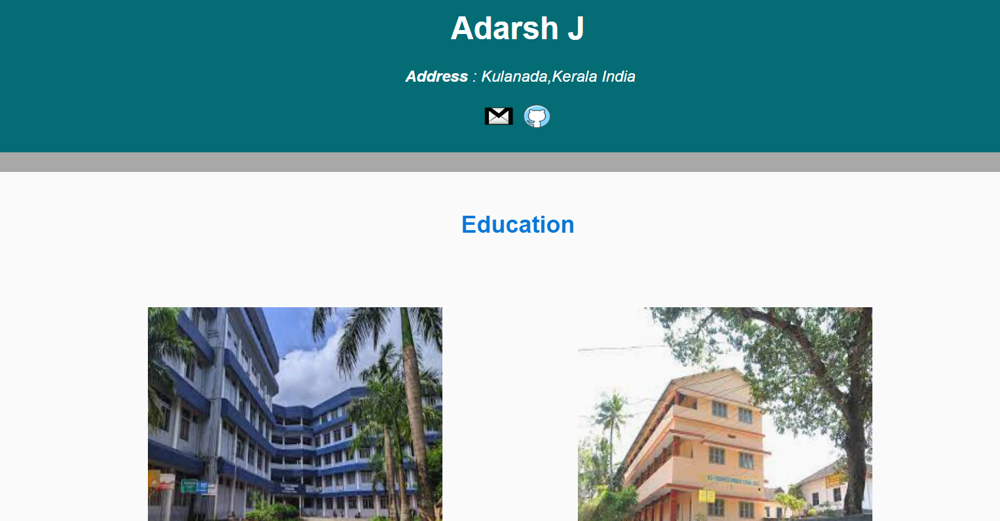

  

<h1 align="center">Hi 👋 I am Adarsh.J</h1>
<h3 align="center">A passionate Coder from India</h3>

- > Love your family,work hard,live with your passion❤️❤️

- > Welcome to my account😁👌 

 

  

  

- 🌱 I’m currently learning **C++,Flutter,Web Development**

- 👯 I’m looking to collaborate on **Web and programming**

- 🤝 I’m looking for help with **Flutter**

- 💬 Ask me about **Something**

- 📫 How to reach me **adarshjn444@gmail.com**

- ⚡ Fun fact ****Coding has over 700 languages****

<h3 align="left">Connect with me:</h3>

 

 

        <h2> Languages and Tools</h2>
           
        

 

 
 

 
 
 

 
    <h2 align="left"> 💻 My workspace:</h2> 
    

   
 
        
  
  
  
  
  
  

 

 

&nbsp;

 
 
